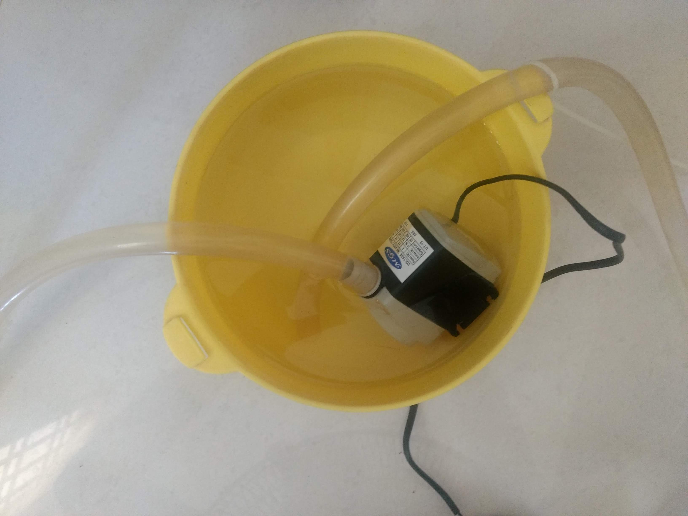
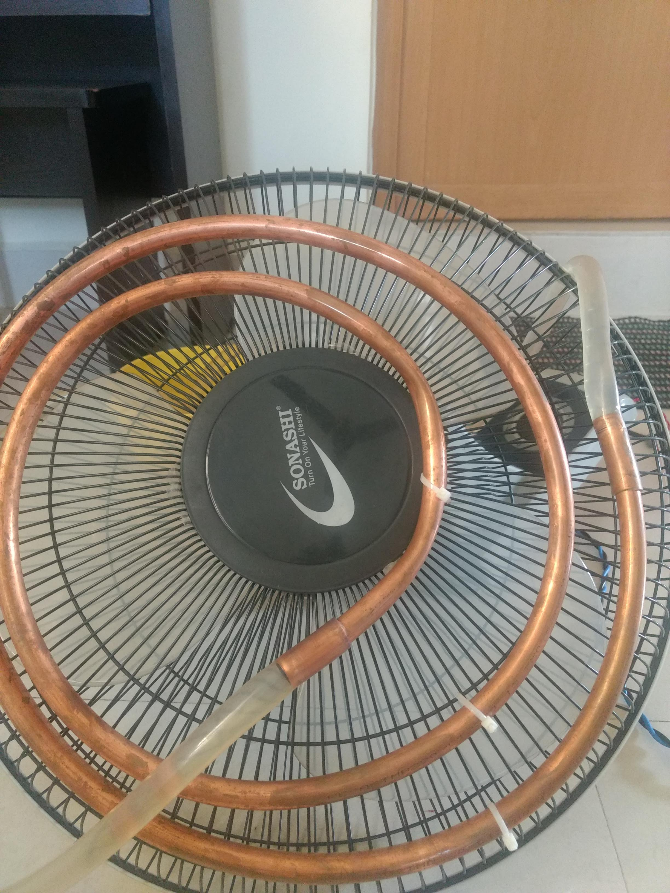

= Home made air cooler

:date: 2019-05-12
:category: DIY
:tags: DIY

Recent days it's horribly hot in chennai. The temperature easily reaches 40°C. And due to humidity it feels much hotter.

Eventhough there is AC at home, it is not economical to use it round the day. Also I'm not ok to buy an aircooler just for the summer.

Thought to make use of this opportunity to try out something that I watched in FB around 5-6 years back. Tried converting my table fan into an aircooler myself. And to my surprise it turned out well and does its job perfectly.

## Final Product:

- I had a cold water container, along with a water pump and copper tube coil. So when the pump starts it will keep circulating the water in the coil.

- Then, attached the copper coil to the front side of the table fan, so that when blown air comes to us, after contacting coil gets cooler.

## Concept:

At a high level, the fan takes the air from the environment and blows it through the copper coil tube that is circulating the cold water. And the cold water takes the temperature from the air. Eventually, reducing the environment temperature. (Will try to add an followup article with metrics and more details.)

## Some Caveats:

- Because of the cold liquid running inside the copper coil, water from atmosphere gets condesed and spills over the floor. Have to tackle it with a cloth. This will eventually also damages the front part of fan.

- The total setup looks bit clumpsy, occupying so much of space. (Still valuable, IKEA effect ;))